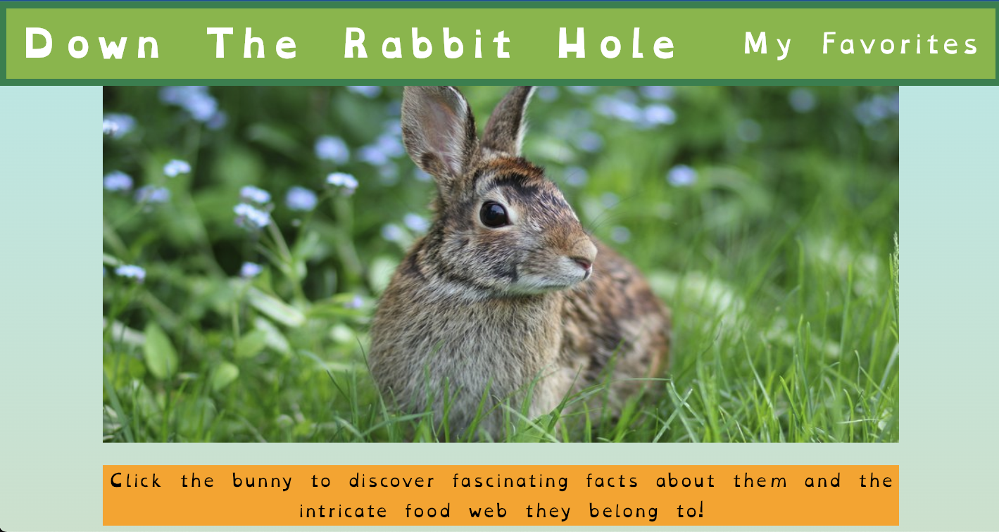
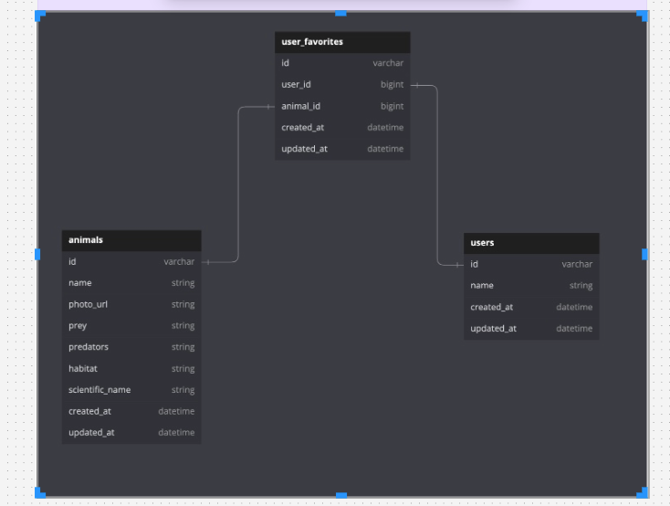

# Down the rabbit hole 

[Down the Rabbit Hole Deployed link](https://down-the-rabbit-hole.netlify.app/)

[GitHub Project board](https://github.com/orgs/Down-the-Rabbit-Holes/projects/2/views/2)

[Figma Planning project board](https://www.figma.com/board/ynLaURjRxnlzNZjrNNcEDD/Down-the-Rabbit-Hole?node-id=0-1&t=okU4GmhfPWX158Hi-1)

"Down the Rabbit Hole” is an engaging educational web application designed to immerse users in the fascinating world of animals and their ecosystems. Users can explore a wealth of animal facts about rabbits, as well as learn about the various predators that hunt them. The interactive platform allows users to follow an educational food chain, discovering a diverse array of animals leading up to apex predators.

## Context

“Down the Rabbit Hole” was developed as a consultancy project, inspired by one team member’s vision and brought to life by a collaborative team of five. Over a two-week period, we transformed the initial idea into a fully functional web application.

Each team member participated in all phases of the project, from ideation to development and presentation. Regular meetings facilitated discussions on progress and challenges, ensuring that everyone had a comprehensive understanding of the codebase and project architecture. This collaborative effort resulted in an engaging educational platform that explores animal ecosystems.

## Tech

BE 
- Ruby on Rails, tested with RSpec, simplecov
- Deployed with [Heroku](https://fathomless-river-45488-66abd37a0e2d.herokuapp.com/)

FE 
- Built with React and tested with Cypress
- Deployed with [Netlify](https://down-the-rabbit-hole.netlify.app/)

## Installation

1. Fork and clone this BE repo 
[Down The Rabbit Hole BE repo](https://github.com/Down-the-Rabbit-Holes/down_the_rabbit_hole_BE)
2. `cd` into the repo
2. Run these commands in your terminal
  - `bundle install`
  -  `rails db:{drop, create, migrate, seed}`
  -  `rails s`

4. Fork this FE repo
[Down the Rabbit Hole FE repo](https://github.com/Down-the-Rabbit-Holes/down_the_rabbit_hole_FE)
5. `cd` into cloned repo
6. Run `npm install`
7. Run `npm start`
8.  Enter `control + c` in your terminal to stop running the React app at any time
9. To run Cypress tests, use `npx cypress open`

## Contributors:

Candice Cirbo - [linkedin](https://www.linkedin.com/in/candicecirbo/) - [gitHub](https://github.com/CCirbo) - ccirbots@gmail.com

Jim Macur - [linkedin](https://www.linkedin.com/in/jimmacur/) - [gitHub](https://github.com/jimmacur) - jim.macur@gmail.com 

Marshall Hotaling - [linkedin](https://www.linkedin.com/in/marshall-hotaling-7b52a8304/) - [gitHub](https://github.com/marshallhotaling) - 	marshall.hotaling@gmail.com

Renee Messersmith - [linkedin](https://www.linkedin.com/in/reneemessersmith/) - [gitHub](https://github.com/reneemes) - rmessersmith@gmail.com

Stefan Bloom - [linkedin](https://www.linkedin.com/in/stefanjbloom/) - [gitHub](https://github.com/stefanjbloom) - 	stefanjbloom@gmail.com

## Learning Goals

- **Project Ideation and Execution**: Develop a web application from a student-led idea, focusing on solving real-world problems.

- **Team Dynamics and Collaboration**: Enhance understanding of team dynamics by participating in all phases of project development, from ideation to presentation.

- **Service-Oriented Architecture (SOA)**: Gain practical experience with SOA by implementing at least one Rails backend service and a React frontend application.

- **Professional Development**: Prepare for workplace environments by working on a larger team and understanding the impact of changes within a complex system.

- **Technical Skills**:
  - Implement and deploy both backend (Rails API) and frontend (ReactJS) applications.
  - Utilize at least one external API.
  - Ensure thorough testing, including unit and integration tests.
  - Adhere to MVC architecture and refactor API consumption out of controllers.

- **User Empathy and Design**: Develop user personas to understand target users better and conduct an equity analysis to prioritize inclusion.

- **Frontend Development**:
  - Build a multi-page application with React Router.
  - Implement error-handling.
  - Conduct robust Cypress testing.
  - Ensure responsive design across different screen sizes.

- **Backend Development**:
	- Database Design: Design and implement relational databases (e.g., PostgreSQL) and optimize queries.
	-	API Development: Create RESTful APIs with Rails and integrate third-party APIs securely.
	- Testing: Write unit tests with RSpec and check coverage with simplecov.
	•	Version Control: Use Git for collaboration, including branching strategies and code reviews

- **Deployment**: Deploy both frontend and backend applications using platforms like Vercel or Netlify for the frontend.
